# My Portfolio Web Sitesi
Bu projeyi Murat Yücedağ'ın Udemy'de yayınladığı toplamda 4 saatlik iki parttan oluşan Asp.Net Core ile Portfolyo Uygulamanızı Geliştirin videosuyla yaptım. 
Proje benim deneyimimlerimle oluşan bir web sitesidir.

## Kullanılan Teknolojiler
---
* C#
* Sqlite
* Asp.net
* Entity Framework Core
* Razor Pages / Views
* MVC (Model-View-Controller)
* ViewComponents
* Migration
* Git & GitHub

## Kullanılan Tasarım
---
* Theme Kita
* Styleshout

## Kullanılan Framework Sürümü
---
* Entity Framework Core 9.0.8

## Projeden Görseller
---

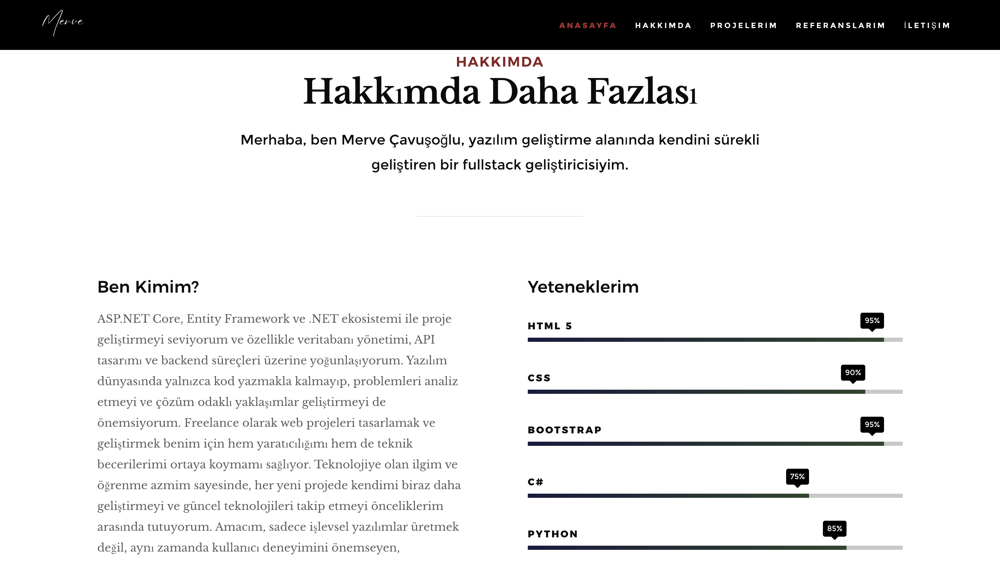
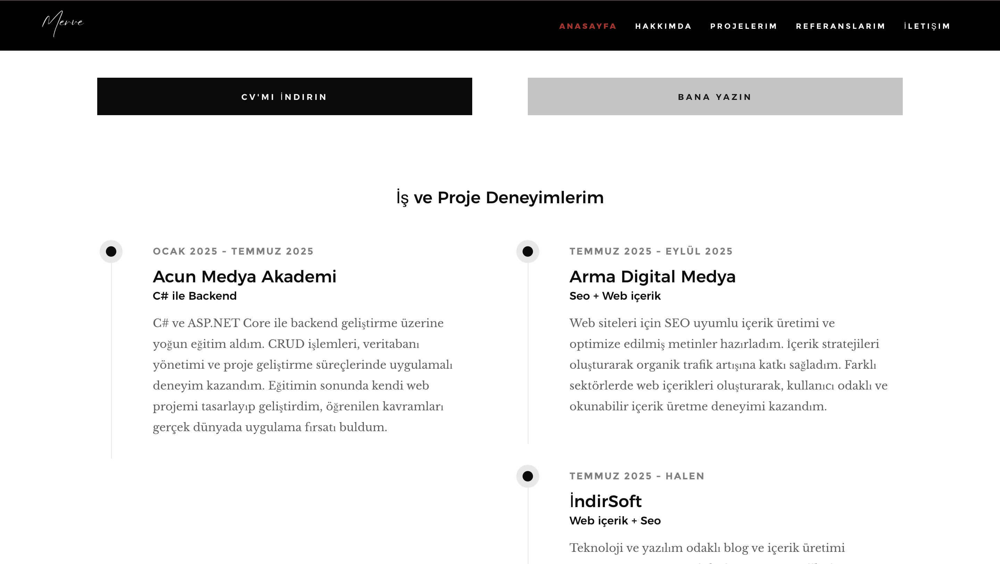
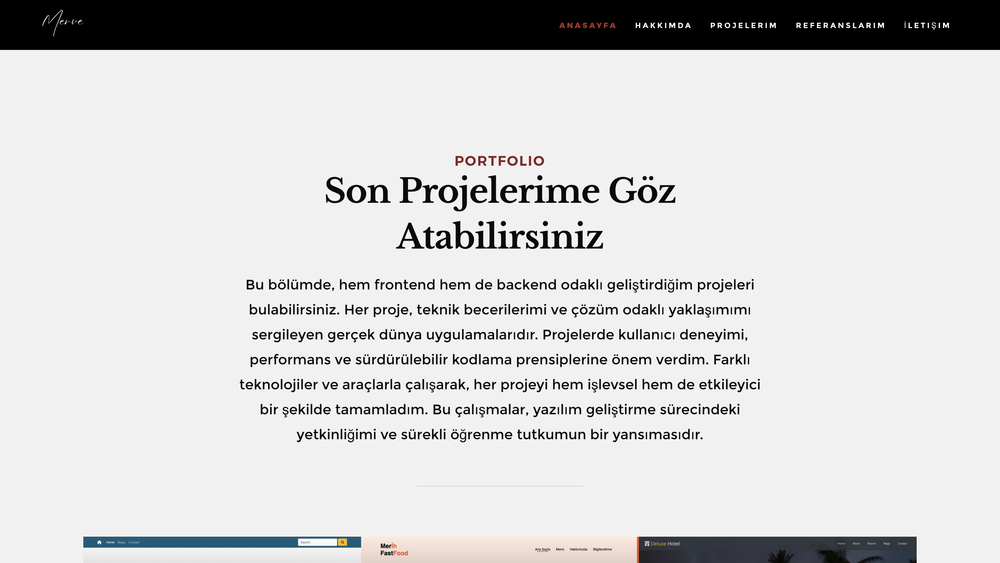
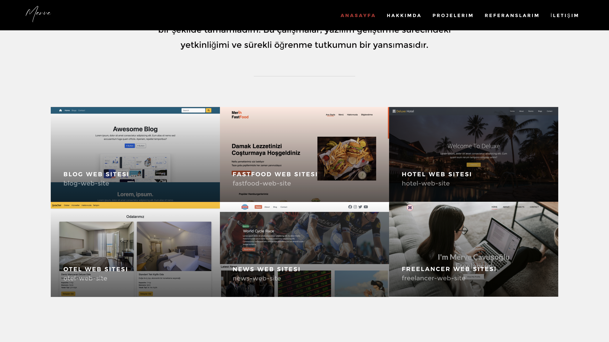
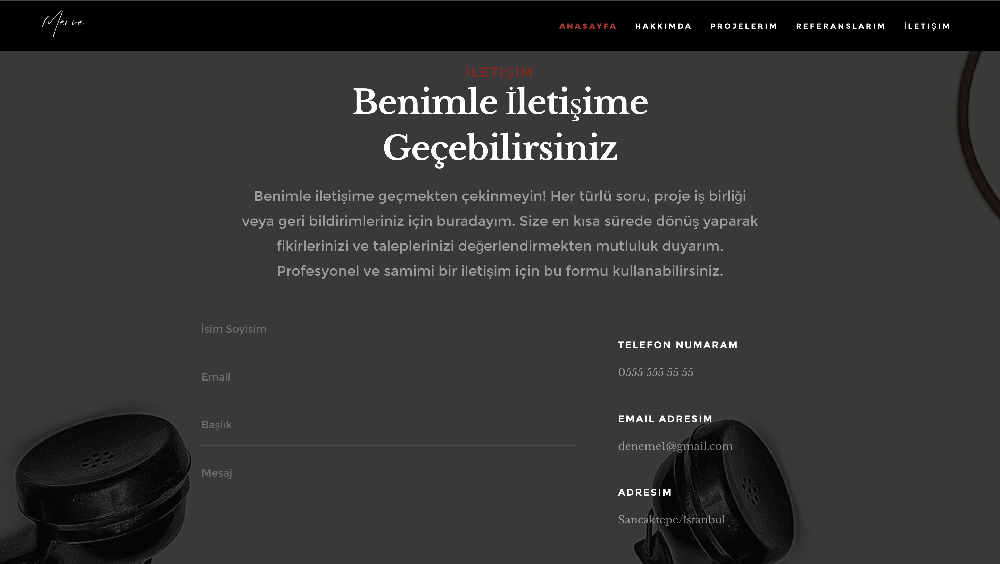
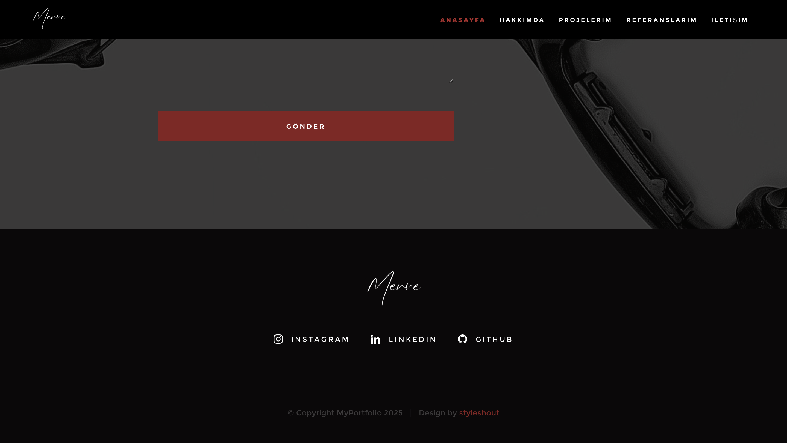
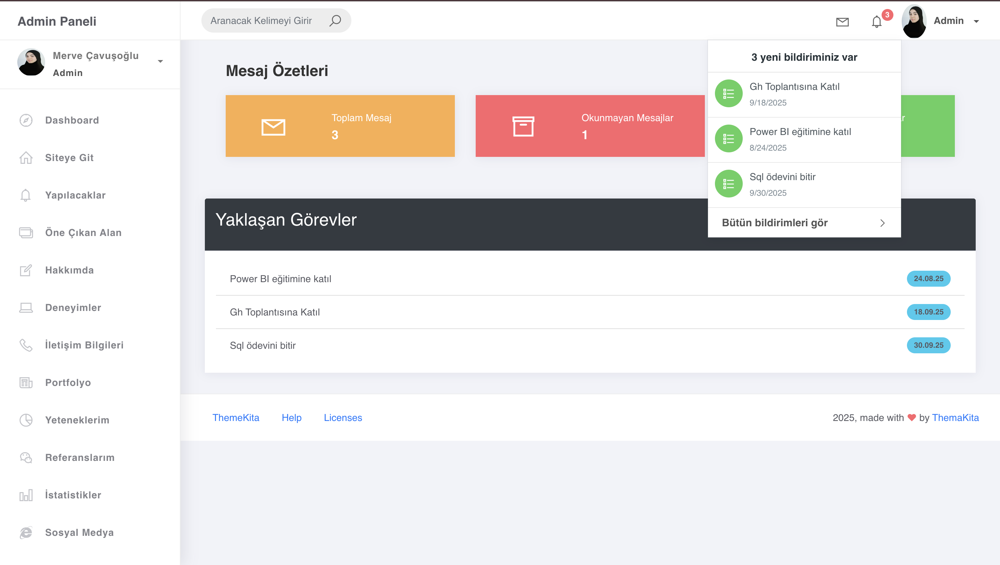
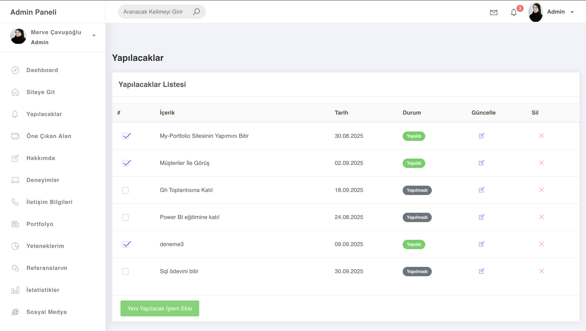
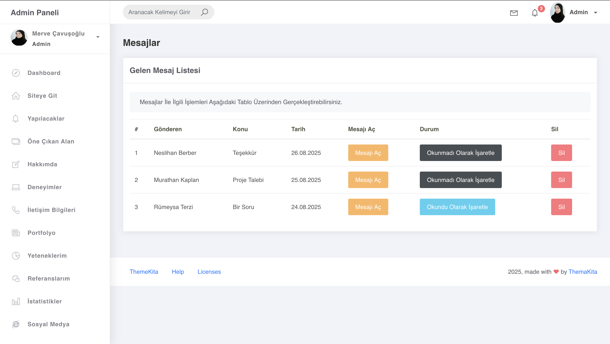
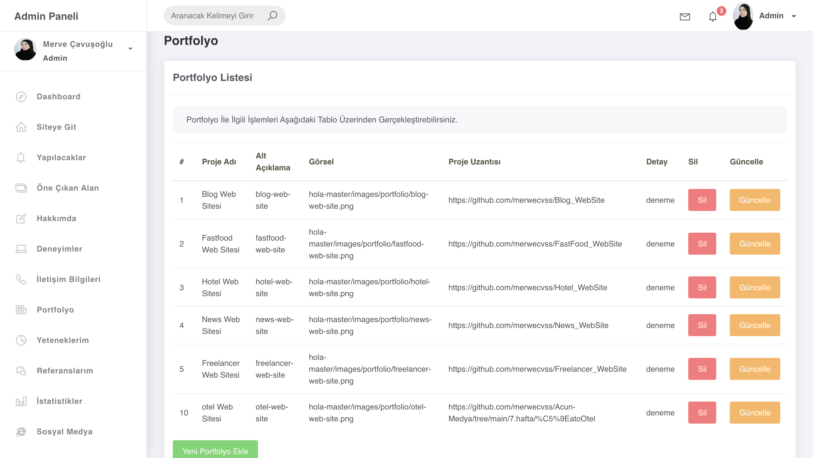
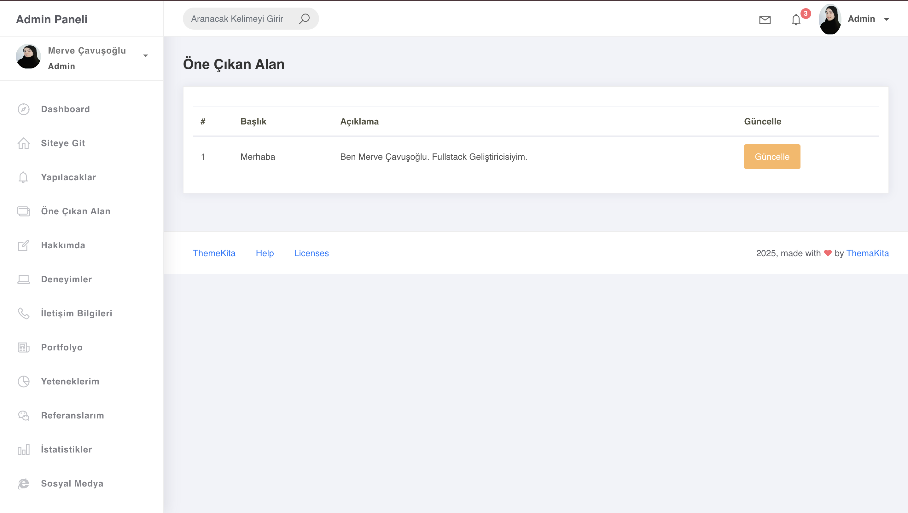
